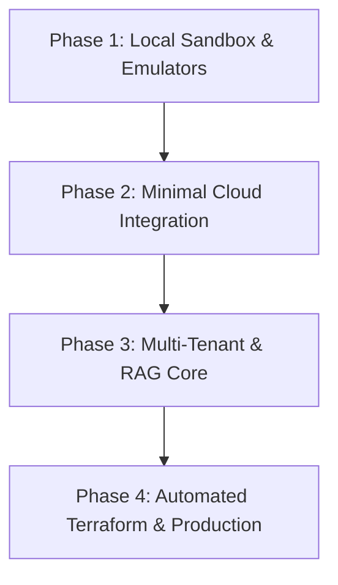

# Execution Plan for RAGaaS (RAG-as-a-Service)

This document outlines the implementation strategy, budgeting, and cost guardrails for the RAGaaS application. 

> [!TIP]
> **Recommendation**: We strongly advise a **Local-First Development & Testing Strategy**. By leveraging local environments and Firebase Emulators, we can complete 90% of the backend and frontend development for **$0.00**, only deploying to GCP when the core features are validated.

---

## 1. Budget, Cost Plan & Financial Guardrails

To protect promotional capital and maximize the $1,000 credit, we establish a **Zero-Baseline Cost Model** where idle resources cost exactly **$0.00**.

### Cost Estimation Table

| Resource / Component | Tier / Configuration | Dev / Staging Cost | Production Cost (Idle) | Production Cost (Active / Tenant) |
| :--- | :--- | :--- | :--- | :--- |
| **Cloud Run (FastAPI)** | CPU allocated on demand, `min-instances = 0` | **$0.00** (Free Tier covers dev) | **$0.00** | ~$0.08 per 10k requests (vCPU/sec) |
| **Firestore Database** | Native Mode (Multi-Tenant Indexing) | **$0.00** (Via Local Emulator) | **$0.00** | ~$0.06 per 100k read/write ops |
| **Cloud Storage** | Standard Storage, Lifecycle rule: delete after 30 days | **$0.00** (dev uses low-volume PDFs) | **$0.00** | $0.02 per GB/month |
| **Firebase Hosting** | Static asset distribution | **$0.00** (dev uses local host) | **$0.00** | $0.026 per GB transferred |
| **Vertex AI Search** | Enterprise Search Datastore | **$0.00** (dev uses mocked RAG locally) | **$0.00** | $1.00 - $3.00 per 1,000 queries |
| **Gemini 1.5 Flash API** | Vertex AI LLM Generation | **$0.00** (dev uses mocked output / key) | **$0.00** | $0.075 / million input tokens |

---

### Cost Alerts & Cloud Guardrails (GCP Setup)

1.  **Strict Monthly Budget Alert**:
    *   Create a GCP Budget set at a conservative **$25.00 / month**.
    *   Configure email and Pub/Sub notifications at **25% ($6.25)**, **50% ($12.50)**, **75% ($18.75)**, and **90% ($22.50)** of the budget.
    *   *(Optional)* Link the Pub/Sub topic to a lightweight Cloud Function to programmatically disable API services or cap resources if the 90% threshold is breached.
2.  **Daily BigQuery Telemetry**:
    *   Enable Cloud Billing Export to a BigQuery dataset immediately upon project setup.
    *   Construct a simple SQL query to track per-tenant operational costs on a daily basis.

### Application-Level Circuit Breakers

To safeguard against infinite loops (e.g., frontend fetch loops) and malicious usage:
*   **Daily Request Counter**: Store daily request telemetry per tenant in Firestore.
*   **Real-time Middleware**: FastAPI middleware intercepts every request, checks the count, and instantly responds with `HTTP 429 Too Many Requests` once the tenant exceeds **1,000 queries** in a billing cycle.
*   **Size Capping**: Reject any document upload larger than **50 MB** before transmitting it to GCS.

---

## 2. Updated Implementation Phases (Local-First Flow)

### Phase 1: Local Sandbox & Emulator Setup ($0.00 Cost)
*   **Firebase Local Emulator**: Set up local emulators for:
    *   **Firebase Auth**: Test sign-ups, sign-ins, and JWT validation locally.
    *   **Cloud Firestore**: Build and verify database schemas for `tenants`, `users`, and `prompts`.
*   **FastAPI Mock Ingestion**:
    *   Configure FastAPI to run on `http://localhost:8000`.
    *   Implement `/api/upload` endpoint using a local directory for storage and standard Python libraries (e.g., PyPDF2) for text extraction.
    *   Mock the Vertex AI Grounded Generation responses locally using static prompt templates or direct, low-cost Gemini API keys.
*   **React Dashboard UI**:
    *   Build the Admin Dashboard and Chat Widget using local development servers (`http://localhost:5173`).
    *   Connect the frontend directly to local FastAPI and Firebase Emulators.

### Phase 2: Minimal Cloud Integration & Vertex AI Setup
*   **Initial GCP Project Hookup**: Link the billing account and enable essential APIs (Vertex AI, Cloud Storage, Firestore).
*   **Single Development Datastore**:
    *   Provision a **single** Cloud Storage bucket (e.g., `ragaas-dev-ingest`) and a **single** Vertex AI Search Datastore manually or via a basic script (rather than the full complex Terraform pipeline).
*   **Connect Backend to GCP**:
    *   Swap the local mock upload function with actual uploads to the GCP bucket.
    *   Connect the `/api/chat` RAG endpoint to the Vertex AI Grounded Generation API, using a specific metadata filter to isolate the test tenant's documents.

### Phase 3: Multi-Tenant Isolation & Quota Middleware
*   **Directory Isolation**: Configure Cloud Storage paths to enforce rigid separation: `gs://ragaas-ingest-bucket/{tenant_id}/*.pdf`.
*   **Vertex AI Filters**: Implement metadata filtering in the RAG pipeline so Vertex AI Search queries are strictly scoped to the querying tenant's `tenant_id` attribute.
*   **Quota Enforcement**: Integrate the Firestore-backed Quota Middleware to enforce the 1,000-query limits.

### Phase 4: Automated Terraform & Production Deployment
*   **Write Terraform (IaC)**: Code the full cloud infrastructure (`main.tf`, `variables.tf`, etc.) to automatically build identical production and staging environments on GCP.
*   **Backend Deployment**: Package the FastAPI app into a optimized Docker image and deploy to Cloud Run using `min-instances = 0` via the `cloudrun` MCP server.
*   **Frontend Deployment**: Build the React application and deploy it to Firebase Hosting via the `firebase-mcp-server` MCP.

---

## 3. Verification & Testing Plan

### Local Verification
*   **Authentication Check**: Ensure valid JWTs are issued by the Firebase Auth emulator and correctly verified by the FastAPI middleware.
*   **Circuit Breaker Simulation**: Send >1,000 rapid mocked requests to verify that the FastAPI backend rejects further calls with HTTP 429.

### Cloud Integration & Security Verification
*   **Tenant Data Separation**: Upload `secret_a.pdf` for Tenant A and `secret_b.pdf` for Tenant B. Run queries as Tenant A and confirm that no data from `secret_b.pdf` is ever leaked or returned.
*   **Cold Start Benchmarking**: Trigger the Cloud Run instance after a period of inactivity to measure the initialization latency, optimizing container imports if start time exceeds 3 seconds.
