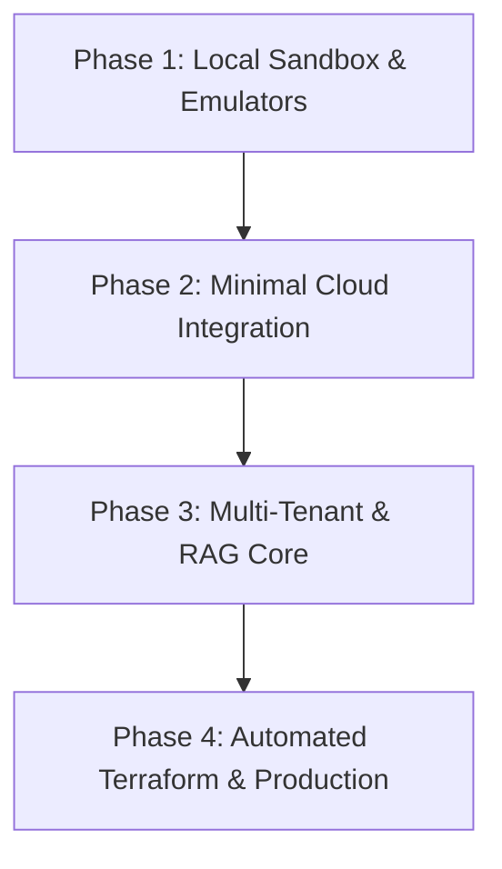

# Execution Plan for RAGaaS (RAG-as-a-Service)

This document outlines the implementation strategy, budgeting, and cost guardrails for the RAGaaS application. 

> [!TIP]
> **Recommendation**: We strongly advise a **Local-First Development & Testing Strategy**. By leveraging local environments and Firebase Emulators, we can complete 90% of the backend and frontend development for **$0.00**, only deploying to GCP when the core features are validated.

---

## 1. Budget, Cost Plan & Financial Guardrails

To protect promotional capital and maximize the $1,000 credit, we establish a **Zero-Baseline Cost Model** where idle resources cost exactly **$0.00**.

### Cost Estimation Table

| Resource / Component | Tier / Configuration | Dev / Staging Cost | Production Cost (Idle) | Production Cost (Active / Tenant) |
| :--- | :--- | :--- | :--- | :--- |
| **Cloud Run (FastAPI)** | CPU allocated on demand, `min-instances = 0` | **$0.00** (Free Tier covers dev) | **$0.00** | ~$0.08 per 10k requests (vCPU/sec) |
| **Firestore Database** | Native Mode (Multi-Tenant Indexing) | **$0.00** (Via Local Emulator) | **$0.00** | ~$0.06 per 100k read/write ops |
| **Cloud Storage** | Standard Storage, Lifecycle rule: delete after 30 days | **$0.00** (dev uses low-volume PDFs) | **$0.00** | $0.02 per GB/month |
| **Firebase Hosting** | Static asset distribution | **$0.00** (dev uses local host) | **$0.00** | $0.026 per GB transferred |
| **Vertex AI Search** | Enterprise Search Datastore | **$0.00** (dev uses mocked RAG locally) | **$0.00** | $1.00 - $3.00 per 1,000 queries |
| **Gemini 1.5 Flash API** | Vertex AI LLM Generation | **$0.00** (dev uses mocked output / key) | **$0.00** | $0.075 / million input tokens |

---

### Cost Alerts & Cloud Guardrails (GCP Setup)

1.  **Strict Monthly Budget Alert**:
    *   Create a GCP Budget set at a conservative **$25.00 / month**.
    *   Configure email and Pub/Sub notifications at **25% ($6.25)**, **50% ($12.50)**, **75% ($18.75)**, and **90% ($22.50)** of the budget.
    *   *(Optional)* Link the Pub/Sub topic to a lightweight Cloud Function to programmatically disable API services or cap resources if the 90% threshold is breached.
2.  **Daily BigQuery Telemetry**:
    *   Enable Cloud Billing Export to a BigQuery dataset immediately upon project setup.
    *   Construct a simple SQL query to track per-tenant operational costs on a daily basis.

### Application-Level Circuit Breakers

To safeguard against infinite loops (e.g., frontend fetch loops) and malicious usage:
*   **Daily Request Counter**: Store daily request telemetry per tenant in Firestore.
*   **Real-time Middleware**: FastAPI middleware intercepts every request, checks the count, and instantly responds with `HTTP 429 Too Many Requests` once the tenant exceeds **1,000 queries** in a billing cycle.
*   **Size Capping**: Reject any document upload larger than **50 MB** before transmitting it to GCS.

---

## 2. Updated Implementation Phases (Local-First Flow)

### Phase 1: Local Sandbox & Emulator Setup ($0.00 Cost)
*   **Firebase Local Emulator**: Set up local emulators for:
    *   **Firebase Auth**: Test sign-ups, sign-ins, and JWT validation locally.
    *   **Cloud Firestore**: Build and verify database schemas for `tenants`, `users`, and `prompts`.
*   **FastAPI Mock Ingestion**:
    *   Configure FastAPI to run on `http://localhost:8000`.
    *   Implement `/api/upload` endpoint using a local directory for storage and standard Python libraries (e.g., PyPDF2) for text extraction.
    *   Mock the Vertex AI Grounded Generation responses locally using static prompt templates or direct, low-cost Gemini API keys.
*   **React Dashboard UI**:
    *   Build the Admin Dashboard and Chat Widget using local development servers (`http://localhost:5173`).
    *   Connect the frontend directly to local FastAPI and Firebase Emulators.

### Phase 2: Minimal Cloud Integration & Vertex AI Setup
*   **Initial GCP Project Hookup**: Link the billing account and enable essential APIs (Vertex AI, Cloud Storage, Firestore).
*   **Single Development Datastore**:
    *   Provision a **single** Cloud Storage bucket (e.g., `ragaas-dev-ingest`) and a **single** Vertex AI Search Datastore manually or via a basic script (rather than the full complex Terraform pipeline).
*   **Connect Backend to GCP**:
    *   Swap the local mock upload function with actual uploads to the GCP bucket.
    *   Connect the `/api/chat` RAG endpoint to the Vertex AI Grounded Generation API, using a specific metadata filter to isolate the test tenant's documents.

### Phase 3: Multi-Tenant Isolation & Quota Middleware
*   **Directory Isolation**: Configure Cloud Storage paths to enforce rigid separation: `gs://ragaas-ingest-bucket/{tenant_id}/*.pdf`.
*   **Vertex AI Filters**: Implement metadata filtering in the RAG pipeline so Vertex AI Search queries are strictly scoped to the querying tenant's `tenant_id` attribute.
*   **Quota Enforcement**: Integrate the Firestore-backed Quota Middleware to enforce the 1,000-query limits.

### Phase 4: Automated Terraform & Production Deployment
*   **Write Terraform (IaC)**: Code the full cloud infrastructure (`main.tf`, `variables.tf`, etc.) to automatically build identical production and staging environments on GCP.
*   **Backend Deployment**: Package the FastAPI app into a optimized Docker image and deploy to Cloud Run using `min-instances = 0` via the `cloudrun` MCP server.
*   **Frontend Deployment**: Build the React application and deploy it to Firebase Hosting via the `firebase-mcp-server` MCP.

---

## 3. Verification & Testing Plan

### Local Verification
*   **Authentication Check**: Ensure valid JWTs are issued by the Firebase Auth emulator and correctly verified by the FastAPI middleware.
*   **Circuit Breaker Simulation**: Send >1,000 rapid mocked requests to verify that the FastAPI backend rejects further calls with HTTP 429.

### Cloud Integration & Security Verification
*   **Tenant Data Separation**: Upload `secret_a.pdf` for Tenant A and `secret_b.pdf` for Tenant B. Run queries as Tenant A and confirm that no data from `secret_b.pdf` is ever leaked or returned.
*   **Cold Start Benchmarking**: Trigger the Cloud Run instance after a period of inactivity to measure the initialization latency, optimizing container imports if start time exceeds 3 seconds.

---

## 4. Pre-Revenue Feature Dev & Test Plan

All testing done against local stack: Firebase emulators (:9099/:8080) + FastAPI (:8000) + Vite (:5173). No GCP spend.

### Phase A — Team Invite & Role Management

**Implementation order:**
1. Add `members` subcollection to Firestore tenant documents. Schema: `{uid, email, role, invitedAt, joinedAt}`.
2. Add backend endpoints:
   - `POST /api/tenant/invite` — Admin only. Creates Firebase Auth user via Admin SDK, writes pending member to Firestore, returns invite link.
   - `GET /api/tenant/members` — Admin only. Returns member list.
   - `PATCH /api/tenant/members/{uid}` — Admin only. Change role.
   - `DELETE /api/tenant/members/{uid}` — Admin only. Remove member.
3. Add role-enforcement middleware: extract `uid` from verified token → lookup `tenants/{tenantId}/members/{uid}.role` → inject `principal.role` into request state.
4. Guard existing endpoints: `/api/upload` requires `role in [admin, uploader]`, `/api/documents DELETE` requires `role == admin`, `/api/chat` requires any valid member.
5. Add `MembersPanel.tsx` component in Sidebar: shows member list, invite input, role dropdown, remove button.

**Dev test checklist:**
- [ ] Sign in as `demo@ragaas.local` (admin). Invite `viewer@ragaas.local` via `/api/tenant/invite`. Verify member appears in Firestore emulator UI (localhost:4000).
- [ ] Sign in as `viewer@ragaas.local`. Try `POST /api/upload` — expect HTTP 403. Try `GET /api/chat` — expect 200.
- [ ] Sign in as `demo@ragaas.local`. Remove `viewer@ragaas.local`. Sign in again as viewer — expect HTTP 403 on `/api/chat`.
- [ ] Change viewer to uploader role. Re-test upload — expect 200.
- [ ] Playwright: `/verify-layout` confirms MembersPanel renders with correct role badges.

**Emulator note:** Firebase Auth emulator supports `createUser()` via Admin SDK. Invite email sending is mocked (log invite link to console in dev mode).

---

### Phase B — Citation-Grounded Answers

**Implementation order:**
1. Update `/api/chat` response schema: `{answer, citations: [{file, page, chunk_index, excerpt, score}]}`.
2. Retrieval logic: after keyword match, include `score` (match count / total chunks) per chunk. Filter out chunks where `score < 0.4`.
3. If zero chunks pass threshold: return `{answer: "I could not find this in your documents.", citations: []}` — do not call LLM.
4. LLM stub (pre-Vertex AI wiring): build answer from top 3 chunks concatenated, return them as citations. This makes the citation flow testable before real RAG.
5. Add `CitationCard.tsx`: collapsed card showing `📄 filename · page N`. Expand shows `excerpt` text. Style with Apple design tokens.
6. `ChatWindow.tsx`: render `citations` array below each assistant bubble.

**Dev test checklist:**
- [ ] Upload `test.pdf` (any multi-page PDF). Ask a question whose answer is on page 2. Verify response JSON has `citations[0].page == 2` and `excerpt` contains relevant text.
- [ ] Ask a question with no match (e.g., "What is the weather today?"). Verify answer is the not-found message and `citations` is empty.
- [ ] Ask a question with a weak match (only 1 word hits). Verify chunk is filtered if score < 0.4.
- [ ] Frontend: click citation card — verify excerpt expands. Click again — collapses.
- [ ] pytest: add `test_citations.py` — upload a known PDF with known content, query known phrase, assert citation page and excerpt in response.

---

### Phase C — Multi-File Batch Upload

**Implementation order:**
1. `UploadBar.tsx`: change `<input type="file" accept=".pdf">` to `<input type="file" accept=".pdf" multiple>`.
2. Replace single XHR with upload queue: array of `{file, status, progress, error}`.
3. Upload dispatcher: pull from queue, run max 3 concurrent uploads using XHR pool.
4. Per-file `UploadItem.tsx` row: filename, progress bar, status chip (queued/uploading/done/failed), error message.
5. No backend changes needed — `/api/upload` already handles one file per call.

**Dev test checklist:**
- [ ] Select 5 PDFs at once in file picker. Verify all 5 appear in queue with "queued" status.
- [ ] Watch upload: max 3 show "uploading" simultaneously, rest stay "queued" until a slot frees.
- [ ] Include one non-PDF file (e.g., `.txt`) — verify it shows "failed: PDF only" without blocking others.
- [ ] Include one file >50MB — verify pre-flight Content-Length rejection shows inline error.
- [ ] After all done: sidebar document list refreshes and shows all newly uploaded files.
- [ ] Playwright: automate 3-file upload via `browser_file_upload`, assert all 3 appear in doc list.

---

### Phase D — Data Privacy Page & Tenant Erasure

**Implementation order:**
1. Add `frontend/src/pages/Privacy.tsx` — static React component with full privacy statement (region, encryption, retention, processors, no-training clause).
2. Add route `/privacy` in `App.tsx` React Router config.
3. Add "Privacy & Data Policy" link on `AuthForm.tsx` login page.
4. Add `DELETE /api/tenant` backend endpoint:
   - Verifies caller is Admin role.
   - Deletes all files under `local_data/uploads/{tenant_id}/` (dev) / GCS prefix (prod).
   - Removes all Firestore docs: tenant record, members subcollection, usage counters.
   - Removes tenant from `index.json`.
   - Returns `{deleted: true, tenant_id}`.
5. Add "Delete Tenant Data" danger button in MembersPanel (Admin only), with confirmation modal.

**Dev test checklist:**
- [ ] Navigate to `http://localhost:5173/privacy` — verify page loads with all required sections (region, encryption, retention, processors, training clause).
- [ ] AuthForm: verify "Privacy & Data Policy" link is visible and navigates to `/privacy`.
- [ ] Sign in as admin. Upload 2 PDFs. Call `DELETE /api/tenant`. Verify:
  - `local_data/uploads/tenant-demo/` directory is empty.
  - Firestore emulator shows tenant doc deleted.
  - `GET /api/documents` returns `[]`.
- [ ] Sign in as non-admin (uploader). Call `DELETE /api/tenant` — expect HTTP 403.
- [ ] pytest: `test_tenant_erasure.py` — seed data, call delete, assert 200 and empty doc list.

---

## 5. Phase Sequencing & Time Estimate

| Phase | Complexity | Est. Dev Time | Test Time | Blocking? |
|---|---|---|---|---|
| A — Team Roles | High (auth logic, Firestore schema, UI) | 2 days | 0.5 days | Yes — needed before any team signup |
| B — Citations | Medium (response schema + UI card) | 1 day | 0.5 days | Yes — needed before any trust |
| C — Batch Upload | Low (frontend only) | 0.5 days | 0.5 days | No — but expected at onboarding |
| D — Privacy Page | Low (static page + 1 endpoint) | 0.5 days | 0.5 days | Yes — legal block without it |
| **Total** | | **4 days** | **2 days** | |

All phases testable locally. Zero GCP spend until Vertex AI wiring (separate phase after these).
